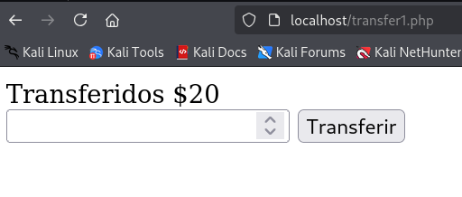
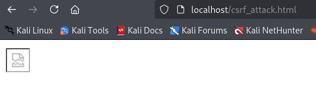
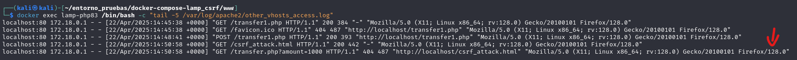
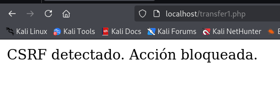
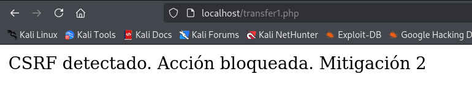
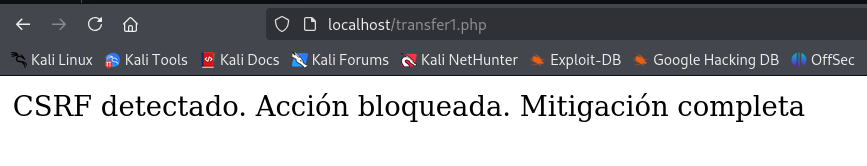

# PPS-Unidad3Actividad7-Cristian

## Índice

- [PPS-Unidad3Actividad7-Cristian](#pps-unidad3actividad7-cristian)
  - [Índice](#índice)
  - [🔍 Descripción](#-descripción)
  - [🎯 Objetivos](#-objetivos)
  - [🧠 ¿Qué es Remote Code Execution (RCE)?](#-qué-es-remote-code-execution-rce)
  - [⚠️ Ejemplos Comunes de RCE](#️-ejemplos-comunes-de-rce)
  - [✍🏻 Actividades a realizar](#-actividades-a-realizar)
  - [Código vulnerable](#código-vulnerable)
  - [Explotación de CSRF](#explotación-de-csrf)
      - [Confirmación del ataque](#confirmación-del-ataque)
      - [Variante de ataque más realista](#variante-de-ataque-más-realista)
  - [Mitigaciones](#mitigaciones)
      - [Verificando que `transfer.php` está protegido correctamente con un token CSRF](#verificando-que-transferphp-está-protegido-correctamente-con-un-token-csrf)
      - [Bloqueando Solicitudes CSRF con Encabezados HTTP](#bloqueando-solicitudes-csrf-con-encabezados-http)
    - [Proteger con ``SameSite=Strict`` en Cookies](#proteger-con-samesitestrict-en-cookies)
    - [Probamos con todas las mitigaciones](#probamos-con-todas-las-mitigaciones)

---

## 🔍 Descripción

Esta actividad tiene como objetivo explorar vulnerabilidades del tipo **Cross-Site Request Forgery (CSRF)** y aplicar técnicas de detección y mitigación en una aplicación vulnerable. A través de pruebas prácticas y análisis de código, se busca comprender cómo un atacante puede forzar a un usuario autenticado a ejecutar acciones no deseadas en una aplicación web.

---

## 🎯 Objetivos

- Entender qué es una vulnerabilidad de falsificación de solicitud entre sitios (CSRF).
- Explorar cómo se puede explotar CSRF en aplicaciones web.
- Identificar puntos vulnerables en el código fuente que permiten CSRF.
- Aplicar técnicas de mitigación para prevenir ataques de CSRF.

---

## 🧠 ¿Qué es Remote Code Execution (RCE)?

**Cross-Site Request Forgery (CSRF)** es un tipo de ataque que hace que un usuario realice acciones no deseadas en una aplicación web en la que está autenticado. CSRF aprovecha la confianza que un sitio tiene en el navegador del usuario, no en la validación de quién envía la solicitud.

Un ataque CSRF puede permitir al atacante realizar acciones como cambiar contraseñas, transferir fondos o modificar información de la cuenta sin el consentimiento del usuario.

---

## ⚠️ Ejemplos Comunes de RCE

1. **Cambio de contraseña sin autorización**: Un formulario vulnerable que no valida la autenticidad de la solicitud puede ser explotado para cambiar la contraseña de un usuario.

```html
<!-- Formulario vulnerable -->
<form action="https://victima.com/cambiar_password.php" method="POST">
    <input type="hidden" name="new_password" value="nuevacontraseña123">
    <input type="submit" value="Enviar">
</form>
```

2. **Transferencia de fondos**: Si una aplicación bancaria no implementa protecciones contra CSRF, un atacante puede engañar a un usuario para transferir dinero.

3. **Modificación de configuración**: Cambiar la dirección de correo electrónico o ajustes de la cuenta sin permiso.


---

## ✍🏻 Actividades a realizar

Para comenzar vamos a utilizar el entorno de pruebas de la actividad [Actividad 1 - Unidad 3](https://github.com/Clealg01/PPS-Unidad3Actividad1-Cristian). En esta actividad nos clonamos un entorno de pruebas lamp, el cual utilizaremos para las actividades.

## Código vulnerable

Crear el archivo vulnerable `transfer1.php`. Este script simula la funcionalidad de una entidad bancaria en línea, permitiendo realizar una transferencia de dinero.

El problema es que **no valida el origen de la solicitud**, permitiendo que cualquier sitio web externo pueda enviar una petición maliciosa en nombre del usuario autenticado.

```php
<?php
// Si el método de la solicitud es POST
if ($_SERVER["REQUEST_METHOD"] === "POST") {
    // Obtener el monto enviado por el formulario
    $amount = $_POST["amount"];
    // Confirmar la transferencia
    echo "Transferidos $$amount";
}
?>

<!-- Formulario de transferencia -->
<form method="post">
    <input type="number" name="amount" placeholder="Monto a transferir">
    <button type="submit">Transferir</button>
</form>
```

<p align="center">
  
</p>
<p align="center"><em>Uso legítimo de la funcionalidad</em></p>


> **Problema de seguridad**: No existe ninguna verificación de autenticidad o protección CSRF. Cualquier atacante podría engañar al navegador del usuario para enviar solicitudes POST automáticamente a transfer1.php, transfiriendo dinero sin su consentimiento.

## Explotación de CSRF

Un atacante puede crear un archivo malicioso `csrf_attack.html` para aprovechar la vulnerabilidad en `transfer.php`.

```html
<!DOCTYPE html>
<html>
<body>
    
</body>
</html>
```

> **Nota**: El archivo no se encuentra en la web del banco, sino alojado en un sitio externo controlado por el atacante. Puede distribuirse vía email, mensajería o inyectarse en otro sitio.

<p align="center">
  
</p>
<p align="center"><em>Enlace no legítimo</em></p>


Cuando un usuario autenticado accede a esta página:
- La imagen no se carga (porque no es realmente una imagen).
- El navegador realiza automáticamente una petición GET a ``transfer.php``.
- Se transfiere dinero sin que el usuario lo sepa.

#### Confirmación del ataque

Para confirmar que el ataque CSRF ocurrió, revisamos los logs de Apache (por ejemplo, ``/var/log/apache2/access.log`` o similar):

```bash
docker exec lamp-php83 /bin/bash -c "tail -5 /var/log/apache2/other_vhosts_access.log"
```

<p align="center">
  
</p>
<p align="center"><em>Confirmación de una transacción no legítima</em></p>


Observamos en el log:

- Una solicitud ``GET`` a ``transfer.php?amount=1000`` proveniente de ``csrf_attack.html``.
- El servidor respondió con código ``200 OK``, indicando que la transacción fue exitosa.

Esto demuestra que ``transfer.php`` es vulnerable a CSRF al no validar el origen de las solicitudes ni utilizar tokens de protección.

#### Variante de ataque más realista

Podemos ocultar aún más el ataque utilizando un formulario automático para simular el comportamiento legítimo de la aplicación.

Archivo csrf_attack2.html:

```html
<!DOCTYPE html>
<html>
<body>
    <form action="http://localhost/transfer1.php" method="POST">
        <input type="hidden" name="amount" value="1000">
        <input type="submit">
    </form>
    <script>
        document.forms[0].submit();
    </script>
</body>
</html>
```
- El formulario se envía automáticamente mediante JavaScript (``document.forms[0].submit()``).
- La víctima ni siquiera nota que se ha enviado una transferencia al visitar la página.
- Si la víctima accede mediante un enlace a esta página, se estaría haciendo la transferencia automáticamente.

Cuando el usuario realiza la acción, el sistema muestra:

<p align="center">
  
</p>
<p align="center"><em>Segunda transferencia no legítima</em></p>

El usuario no se da cuenta de que en realidad ha realizado una transferencia no autorizada a favor del atacante.

## Mitigaciones

#### Verificando que `transfer.php` está protegido correctamente con un token CSRF

Para proteger la transferencia contra ataques CSRF, modificamos `transfer.php` agregando un sistema de validación de token.

Nos aseguramos de que el código tenga la siguiente lógica:

```php
<?php
session_start();

// Generar un token CSRF si no existe
if (empty($_SESSION['csrf_token'])) {
    $_SESSION['csrf_token'] = bin2hex(random_bytes(32));
}

// Solo aceptar solicitudes POST con un token CSRF válido
if ($_SERVER["REQUEST_METHOD"] === "POST") {
    if (!isset($_POST['csrf_token']) || $_POST['csrf_token'] !== $_SESSION['csrf_token']) {
        die("CSRF detectado. Acción bloqueada.");
    }

    $amount = $_POST["amount"];
    echo "Transferidos $$amount";
}
?>

<!-- Formulario de transferencia protegido -->
<form method="post">
    <input type="number" name="amount" placeholder="Monto a transferir" required>
    <input type="hidden" name="csrf_token" value="<?php echo $_SESSION['csrf_token']; ?>">
    <button type="submit">Transferir</button>
</form>
```

> **Nota**: Si el token CSRF no está presente o no coincide con el de la sesión, la ejecución se detiene inmediatamente y se muestra un mensaje de error.

Cuando el atacante intenta ejecutar ``csrf_attack2.html``:

- El servidor detecta la falta de un token CSRF válido.
- La operación es bloqueada y se muestra el mensaje: `CSRF detectado. Acción bloqueada.`

<p align="center">
  
</p>
<p align="center"><em>Mitigación 1 exitosa</em></p>

#### Bloqueando Solicitudes CSRF con Encabezados HTTP

Además de utilizar tokens CSRF, podemos reforzar la protección bloqueando peticiones automáticas que no contengan el encabezado `X-Requested-With`, característico de las solicitudes AJAX legítimas.

Modificamos `transfer.php` para agregar esta verificación adicional:

```php
<?php
session_start();
// Generar un token CSRF si no existe
if (empty($_SESSION['csrf_token'])) {
        $_SESSION['csrf_token'] = bin2hex(random_bytes(32));
}
// Solo permitir solicitudes POST con un token CSRF válido
if ($_SERVER["REQUEST_METHOD"] == "POST") {
        if (!isset($_POST['csrf_token']) || $_POST['csrf_token'] !== $_SESSION['csrf_token']) {
                die("CSRF detectado. Acción bloqueada. Mitigación 2");
        }
// Bloquear peticiones que no sean AJAX legítimas
        if (!isset($_SERVER['HTTP_X_REQUESTED_WITH']) || $_SERVER['HTTP_X_REQUESTED_WITH'] !=='XMLHttpRequest') {
                die("CSRF detectado. Acción no permitida. Mitigación 2");
        }

        $amount = $_POST["amount"];
        echo "Transferidos $$amount";
}
?>
<form method="post">
        <input type="number" name="amount">
        <input type="hidden" name="csrf_token" value="<?php echo $_SESSION['csrf_token']; ?>">
        <button type="submit">Transferir</button>
</form>
```
> **Nota**: Esta medida adicional ayuda a detectar y bloquear solicitudes que no fueron iniciadas legítimamente por el cliente (como formularios ocultos o imágenes maliciosas).

Al intentar ejecutar de nuevo el ataque ``csrf_attack2.html``:

- El servidor detecta que falta el encabezado X-Requested-With.
- Bloquea la solicitud y muestra el mensaje: ``CSRF detectado. Acción no permitida. Mitigación 2``

<p align="center">
  
</p>
<p align="center"><em>Mitigación 2 exitosa</em></p>

### Proteger con ``SameSite=Strict`` en Cookies

Otra medida de protección contra CSRF es configurar las cookies de sesión para que no se envíen en solicitudes externas, utilizando el atributo `SameSite=Strict`.

Para ello, modificamos la configuración de sesión en `transfer.php`:

```php
<?php
// Configurar cookies de sesión para SameSite=Strict
session_set_cookie_params(['samesite' => 'Strict']);

// Iniciar la sesión después de configurar las cookies
session_start();
?>
```
> **Nota**: Con ``SameSite=Strict``, el navegador no enviará cookies de sesión si la solicitud proviene de otro dominio o es automática, bloqueando muchos ataques CSRF de manera automática.

Al volver a ejecutar el ataque ``csrf_attack2.html``:

- El navegador no envía la cookie de sesión.
- El servidor no reconoce la sesión y rechaza la solicitud.

Esto fortalece aún más la protección de la aplicación contra solicitudes maliciosas, reduciendo el riesgo de explotación de sesiones.

### Probamos con todas las mitigaciones

Aplicamos todas las defensas combinadas en `transfer1.php`:

```php
<?php
// Configurar la cookie de sesión para bloquear ataques CSRF
session_set_cookie_params([
    'samesite' => 'Strict', // Bloquear solicitudes desde otros sitios
    'httponly' => true,      // Bloquear acceso a la cookie desde JavaScript
    'secure' => false        // Cambiar a true si usas HTTPS
]);

session_start();

// Generar un token CSRF si no existe
if (empty($_SESSION['csrf_token'])) {
    $_SESSION['csrf_token'] = bin2hex(random_bytes(32));
}

// Solo permitir solicitudes POST
if ($_SERVER["REQUEST_METHOD"] !== "POST") {
    die("Error: Método no permitido");
}

// 1 - Validar que el token CSRF esté presente y sea correcto
if (!isset($_POST['csrf_token']) || $_POST['csrf_token'] !== $_SESSION['csrf_token']) {
    die("CSRF detectado. Acción bloqueada.");
}

// 2 - Validar que la solicitud provenga del mismo origen
if (!isset($_SERVER['HTTP_REFERER']) || parse_url($_SERVER['HTTP_REFERER'], PHP_URL_HOST) !== $_SERVER['HTTP_HOST']) {
    die("CSRF detectado. Referer inválido.");
}

// 3 - Bloquear solicitudes que no sean AJAX
if (!isset($_SERVER['HTTP_X_REQUESTED_WITH']) || $_SERVER['HTTP_X_REQUESTED_WITH'] !== 'XMLHttpRequest') {
    die("CSRF detectado. No es una solicitud AJAX válida.");
}

// Si todas las validaciones pasan, procesar la transferencia
$amount = $_POST["amount"];
echo "Transferidos $$amount";
?>

<!-- Formulario protegido -->
<form method="post">
    <input type="number" name="amount" placeholder="Monto a transferir" required>
    <input type="hidden" name="csrf_token" value="<?php echo $_SESSION['csrf_token']; ?>">
    <button type="submit">Transferir</button>
</form>
```
- Bloquea todas las solicitudes ``GET`` (ya no se puede explotar CSRF usando ``GET``).
- Verifica que el csrf_token del formulario coincida con el de la sesión.
- Verifica que el Referer provenga del mismo dominio (``HTTP_REFERER``).
- Exige que la solicitud sea ``AJAX`` (``X-Requested-With: XMLHttpRequest``).

Si la mitigación está funcionando correctamente, cualquier solicitud maliciosa será rechazada y el servidor mostrará un mensaje como: `CSRF detectado. Acción bloqueada.`

<p align="center">
  
</p>
<p align="center"><em>Comprobación de todas las mitigaciones</em></p>
